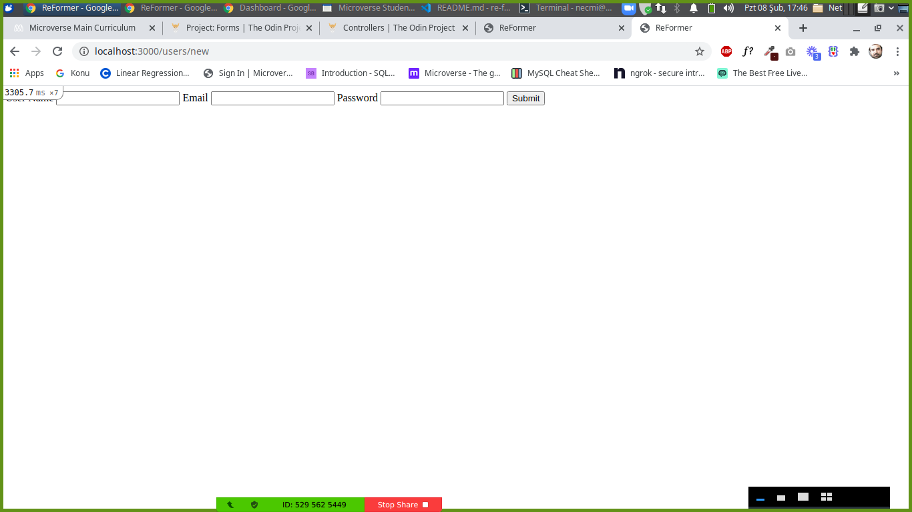

# Creating A Rails Form

This project is about creating a form in pure HTML and reform it by using the form_tag helper and form_with helper in Rails.

The form created in this project includes username, email, password, and submit. This form allows you to create new instances and save them in a table. Also, it enables you to edit the information of users on the table.

The form raises an error when a field is empty.

## Built With

- Ruby on Rails
- Ruby 2.7.2

## Getting Started

To get started with the project follow the steps below:
- `git clone git@github.com:patrick-angelos/re-former.git`
- `cd re-former`
- `bundle install`
- `rails db:migrate`
- To access the new user creation form, use the following route: localhost:3000/users/new.
- To access the edit page for users, use the following route: localhost:3000/users/:id/edit.
- Take a look at the table with `rails console`.
- If you need further assistance for creating instances visit the [Active Record guides](https://guides.rubyonrails.org/active_record_basics.html) of Rails

## Authors

👤 **Patrikis Angelos**

- GitHub: [@patrick-angelos](https://github.com/patrick-angelos)
- Twitter: [@AngelosPatrikis](https://twitter.com/AngelosPatrikis)
- LinkedIn: [Angelos Patrikis](https://www.linkedin.com/in/patrikis-angelos/)

👤 **Necmi Gunduz**
- GitHub: [@necmigunduz](https://github.com/necmigunduz)
- Twitter: [@necm_gun](https://twitter.com/necm_gun)
- LinkedIn: [LinkedIn](https://www.linkedin.com/in/necmigunduz/)

## 🤝 Contributing

Contributions, issues, and feature requests are welcome!

## Show your support

Give a ⭐️ if you like this project!

## 📝 License

Copyright 2021 Necmi Gunduz & Patrikis Angelos

Permission is hereby granted, free of charge, to any person obtaining a copy of this software and associated documentation files (the "Software"), to deal in the Software without restriction, including without limitation the rights to use, copy, modify, merge, publish, distribute, sublicense, and/or sell copies of the Software, and to permit persons to whom the Software is furnished to do so, subject to the following conditions:The above copyright notice and this permission notice shall be included in all copies or substantial portions of the Software.

THE SOFTWARE IS PROVIDED "AS IS", WITHOUT WARRANTY OF ANY KIND, EXPRESS OR IMPLIED, INCLUDING BUT NOT LIMITED TO THE WARRANTIES OF MERCHANTABILITY, FITNESS FOR A PARTICULAR PURPOSE AND NONINFRINGEMENT. IN NO EVENT SHALL THE AUTHORS OR COPYRIGHT HOLDERS BE LIABLE FOR ANY CLAIM, DAMAGES OR OTHER LIABILITY, WHETHER IN AN ACTION OF CONTRACT, TORT OR OTHERWISE, ARISING FROM, OUT OF OR IN CONNECTION WITH THE SOFTWARE OR THE USE OR OTHER DEALINGS IN THE SOFTWARE.